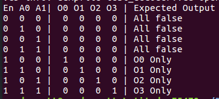
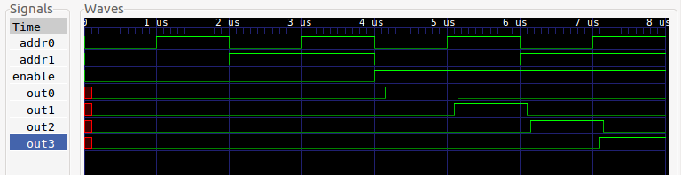
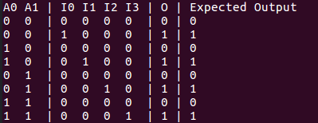
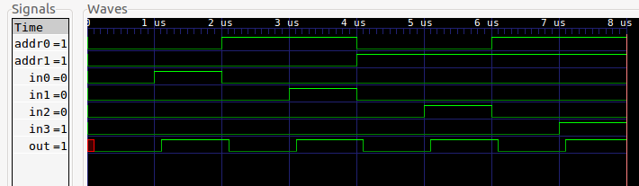
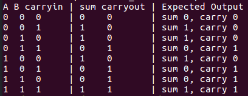
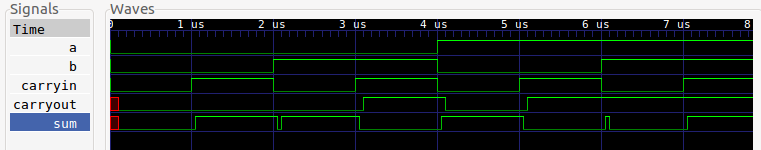

# HW2 Results Write Up

## 2 bit decoder with enable (2+1 inputs, 4 outputs)

Truth table for decoder:

Waveforms for decoder:

## 4:1 (four input multiplexer)

Truth table for multiplexer:

Waveforms for multiplexer:

## 1-bit full adder

Truth table for adder:

Waveforms for adder:

